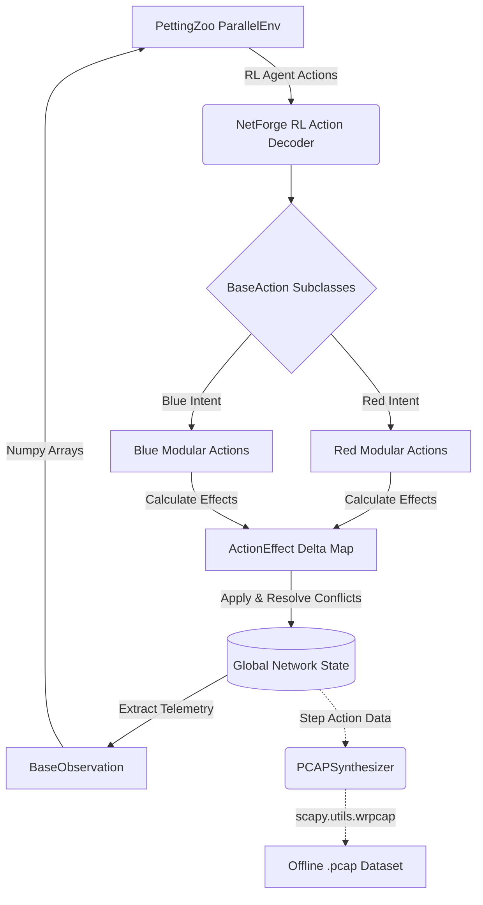

# NetForge RL

Multi-Agent Reinforcement Learning (MARL) cybersecurity simulator mathematically derived from the original [CybORG / CAGE challenge environment](https://github.com/CyberSecurityCRC/CybORG). 

**Author / Maintainer:** Igor Jankowski (igorjankowwski@gmail.com)  
**Project:** NetForge RL
**GNN-based Policy Model:** https://github.com/elprofesoriqo/GNN-based-Policy-Model-for-MARL-Cyber

## Architectural Overhaul Notice

This repository represents a complete structural redesign of the original CybORG framework. I took ownership of this branch because the legacy CybORG environment was fundamentally restricted to single-agent, turn-based paradigms (utilizing nested OpenAI Gym wrappers) which artificially broke parallel gradients and hindered true Multi-Agent research.

### What is Different?
1. **Parallel Execution via PettingZoo:** The core simulator is now strictly built upon the `pettingzoo.ParallelEnv` standard instead of monolithic Gym wrappers. Red and Blue teams act in a simultaneous time vacuum, and the engine natively resolves their conflicting action intents.
2. **Abstract Action Engine:** Actions no longer mutate simulator state directly via complex monolithic switch statements. `BaseAction` computes an `ActionEffect` (JSON representation of physical network impact), which the core environment evaluates and securely commits.
3. **No Legacy Bloat:** I have deleted all obsolete OpenAI Gym references, redundant CAGE challenge sub-modules, and unneeded demo code. 

### Simulator Architecture Flow



## Quick Start & Testing

The environment is designed to be highly plug-and-play. 

```python
from marl_cyborg.environment.parallel_env import ParallelMarlCyborg

# Instantiate the native PettingZoo environment
env = ParallelMarlCyborg(scenario_config={})

# Reset to get parallel Gymnasium boxes
observations, infos = env.reset()

print("Red Box:", observations["Red"])
print("Blue Box:", observations["Blue"])
```

## Building Custom Cyber Attacks (Extensibility)

The primary reason for this fork is extensibility. Want to add an *ARP Poisoning* attack? 

Simply inherit the `BaseAction` inside `marl_cyborg/actions/network/arp_poison.py`, write how it modifies the theoretical `ActionEffect`, and the engine natively calculates the physics resolution. See `marl_cyborg.actions.network.ip_fragmentation.IPFragmentationAction` for a physical example of this structural implementation.

## License & Accreditation
This project is built upon the foundational work provided by the original CybORG contributors (CyberSecurityCRC / DSTG). The core internal simulator physics remain preserved, while the outward translation layers, action hierarchy, and Multi-Agent APIs have been entirely redesigned by Igor Jankowski.

## Repository Structure

- `marl_cyborg/`: Core simulation environment
  - `actions/`: Contains definitions for all `BaseAction` implementations.
    - `red_actions.py`: Red team offensive actions.
    - `blue_actions.py`: Blue team defensive actions.
  - `core/`: State, Observation, and Action abstract base classes.
  - `environment/`:
    - `parallel_env.py`: The primary PettingZoo MARL environment.
    - `pcap_synthesizer.py`: Generates synthetic offline `.pcap` network traffic mappings.
- `train_curriculum.py`: Example RL training script.
- `test_physics.py`: Physics unit tests.

## Available Actions

All actions are natively available to the RL models through the environment's discrete action space (`Discrete(256)`). The engine dynamically scales and maps these 11 actions per team against all available network IPs.

### Red Team (Offensive)
1. **NetworkScan**: Scans a target subnet for active IP addresses.
2. **DiscoverRemoteSystems**: Performs a Ping Sweep to pinpoint active hosts.
3. **DiscoverNetworkServices**: Port scans a host to enumerate running services.
4. **ExploitRemoteService**: Exploits a vulnerability on a target IP to gain User privileges.
5. **PrivilegeEscalate**: Escalates from User to Root access.
6. **Impact**: Destroys/encrypts data on a compromised host (Ransomware/Wiper).
7. **ExploitBlueKeep**: Exploits RDP (CVE-2019-0708) on Port 3389.
8. **ExploitEternalBlue**: Exploits SMB (MS17-010) on Port 445.
9. **ExploitHTTP_RFI**: Remote File Inclusion exploit targeting Port 80.
10. **JuicyPotato**: Local privilege escalation via DCOM (Windows).
11. **V4L2KernelExploit**: Local privilege escalation via Video4Linux kernel vulns (Linux).

### Blue Team (Defensive)
1. **IsolateHost**: Disconnects a host completely from the network.
2. **RestoreHost**: Brings an isolated host back online from a clean snapshot.
3. **Monitor**: Actively monitors traffic on a specific subnet or host for anomalies.
4. **Analyze**: Deep scans a specific host for malware signatures or unauthorized user activity.
5. **DeployDecoy**: Deploys a generic fake service (Apache/Tomcat/Femitter) to bait attackers.
6. **Remove**: Removes unauthorized user privileges.
7. **RestoreFromBackup**: Purges an infected host and restores it to a clean baseline from a backup.
8. **DecoyApache**: Deploys a fake Apache web server (Port 80) honeypot.
9. **DecoySSHD**: Deploys a fake SSH daemon (Port 22) honeypot.
10. **DecoyTomcat**: Deploys a fake Tomcat server (Port 8080) honeypot.
11. **Misinform**: Injects false host telemetry or alters logging to feed Red agents fake data.
