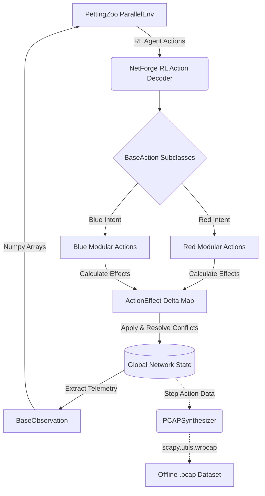

# NetForge RL

Multi-Agent Reinforcement Learning (MARL) cybersecurity simulator mathematically derived from the original [CybORG / CAGE challenge environment](https://github.com/CyberSecurityCRC/CybORG). 

**Author / Maintainer:** Igor Jankowski (igorjankowwski@gmail.com)  
**Project:** NetForge RL

## Architectural Changes & State-of-the-Art Modeling

This repository is a dramatic evolution from the legacy CybORG / CAGE challenge environment. While acknowledging the incredible fundamental work by DSTG, NetForge RL transitions the paradigm from a synchronous, fully observable game into a high-fidelity, physically constrained network simulation designed for real-world Sim-to-Real transfer.

### What is Different?
1. **Interruptible Tick-Based Engine:** CybORG's instantaneous actions are gone. NetForge RL runs on an asynchronous `current_tick` clock. Actions have a `duration` natively. Real-time interruptions exist: if the SOC isolates a host mid-exfiltration, the attacker's action is aborted.
2. **Strict POMDP Isolation & Fog of War:** Defenders do not see the ground truth. They receive dynamic telemetry alerts generated by a newly implemented `siem_log_buffer` suffering from realistic `log_latency`. Background noise agents obfuscate true malicious alerts.
3. **MultiDiscrete Tensors & Procedural Networks:** To avoid static overfitting and combinatorial explosions, Action spaces utilize `MultiDiscrete` Arrays (e.g. `[ActionType, TargetIP]`). Topologies procedurally generate up to 50 active nodes utilizing padded masking dynamically.
4. **Attack Economics & Cost Mechanics:** Each agent is bounded by Operational Budgets (`agent_funds`, `agent_compute`). Reckless defensive isolation triggers massive Business Downtime mathematical penalties mirroring real-world SLA fines.
5. **Cyber-Physical (OT) Convergence:** Generating distinct `OT_Subnets` featuring `PLC` nodes mapping thermodynamic vulnerabilities. Red operators can inflict catastrophic Kinetic Impacts `(+10000/-10000 rewards)` overriding logical state tracking entirely.
6. **Social Engineering (Stochastics):** DMZ architectures can natively be bypassed by Red teams leveraging `SpearPhishing` arrays scaled against dynamically rolled `human_vulnerability_score` matrix properties. Blue counters this via explicit `SecurityAwarenessTraining` capital expenditure.
7. **Ray RLlib & PyTorch LSTMs:** Packaged natively with Custom PyTorch Models linking Recurrent Memory sequences (LSTMs) alongside mathematical boolean Action Masking dropping invalid tensor networks natively out-of-the-box.

### Simulator Architecture Flow



## Quick Start & Testing

The environment is designed to be highly plug-and-play. 

```python
from netforge_rl.environment.parallel_env import NetForgeRLEnv

# Instantiate the native PettingZoo environment
env = NetForgeRLEnv(scenario_config={})

# Reset to get parallel Gymnasium boxes
observations, infos = env.reset()

print("Red Box:", observations["Red"])
print("Blue Box:", observations["Blue"])
```

## Building Custom Cyber Attacks (Extensibility)

The primary reason for this fork is extensibility. Want to add an *ARP Poisoning* attack? 

Simply inherit the `BaseAction` inside `netforge_rl/actions/network/arp_poison.py`, write how it modifies the theoretical `ActionEffect`, and the engine natively calculates the physics resolution. See `netforge_rl.actions.network.ip_fragmentation.IPFragmentationAction` for a physical example of this structural implementation.

## License & Accreditation
This project is built upon the foundational work provided by the original CybORG contributors (CyberSecurityCRC / DSTG). The core internal simulator physics remain preserved, while the outward translation layers, action hierarchy, and Multi-Agent APIs have been entirely redesigned by Igor Jankowski.

## Repository Structure

- `netforge_rl/`: Core simulation environment
  - `actions/`: Contains definitions for all `BaseAction` implementations.
  - `agents/`: Contains specialized algorithmic actors like `GreenAgent` (Background Noise simulation).
  - `core/`: State, Observation, and Action abstract base classes enforcing physical constraints.
  - `environment/`:
    - `parallel_env.py`: The primary asynchronous PettingZoo MARL environment.
    - `pcap_synthesizer.py`: Generates synthetic offline `.pcap` network traffic mappings.
- `train_curriculum.py`: Example RL training script.
- `test_physics.py`: Physics unit tests.

## Available Actions

All actions are natively available to the RL models through the environment's `MultiDiscrete` action space mapped seamlessly via PyTorch Logit structures.

### Red Team (Offensive)
1. **NetworkScan / DiscoverRemoteSystems / DiscoverNetworkServices**: Passive/Active reconnaissance probing ports & ping sweeps.
2. **SpearPhishing**: Bypasses corporate structures directly exploiting human error factors inside user networks.
3. **ExploitRemoteService / ExploitEternalBlue...**: Gain user privileges weaponizing CVEs based on specific OS versions and open Ports.
4. **PrivilegeEscalate**: Pivot from constrained user constraints to `Root`/`System`.
5. **Impact**: Ransomware execution mapping standard IT failure metrics.
6. **OverloadPLC (Kinetic)**: Weaponizes thermodynamics on compromised OT Networks forcing episode kinetic destruction sequences.

### Blue Team (Defensive)
1. **IsolateHost / RestoreHost**: Logical quarantining of suspected nodes (Incurs heavily tracked SLA Business downtime).
2. **Monitor / Analyze**: Asynchronous deep network/host scans bypassing standard physical delays.
3. **SecurityAwarenessTraining**: Burns financial budget mathematically slashing organic `human_vulnerability_scores` defending against phish payloads.
4. **DeployHoneytoken (Active Deception)**: Secretly seeds RAM-based tokens triggering massive unevadable 0-delay severity 10 SIEM alerts when parsed by automated Red lateral mapping capabilities.
5. **DecoyApache / DecoySSHD / DeployDecoy**: Deploys visible port-80/22 traps binding attacker compute resources across dead execution loops.
