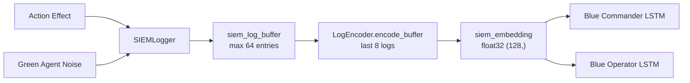

# NLP-SIEM Pipeline

## Overview

Pillar 2 gives Blue agents **authentic SIEM telemetry** as part of their observation. Instead of hand-crafted alert integers, the Blue LSTM reads encoded Windows Event XML strings — the same format a real Splunk/Elastic pipeline would process.

## Pipeline Flow



## SIEMLogger

Generates stochastic Windows Event XML per resolved action:

| Detection Rate | Condition |
|----------------|-----------|
| 90% | Successful Red action |
| 50% | Failed Red action |
| 15%/tick | Background noise (Green agent) |

### Event Templates

| Event ID | Description | Triggered By |
|----------|-------------|--------------|
| `4624` | Successful logon | `ExploitEternalBlue`, `ExploitBlueKeep` |
| `4625` | Failed logon | `NetworkScan`, failed exploits |
| `4648` | Explicit credentials | `PassTheTicket` |
| `4688` | New process created | `PrivilegeEscalate`, `DumpLSASS` |
| `4768` | TGT requested | `PassTheTicket`, `RotateKerberos` |
| `4776` | NTLM credential validation | `PassTheTicket` |
| Sysmon 1 | Process creation | Exploit chains |
| Sysmon 3 | Network connection | All remote exploits |
| **Sysmon 10** | **LSASS process access** | **`DumpLSASS` — highest-fidelity** |
| Sysmon 22 | DNS query | Background noise |

## LogEncoder

Dual-backend encoder:

=== "TF-IDF (Default)"
    ```python
    enc = LogEncoder(backend='tfidf')
    ```
    - `sklearn` TF-IDF with char n-grams (3–5)
    - TruncatedSVD → 128-dim LSA
    - L2 normalised
    - Fit on `payload_library.json` corpus at init

=== "Transformer (Optional)"
    ```python
    enc = LogEncoder(backend='transformer')
    # Requires: pip install sentence-transformers
    ```
    - `all-MiniLM-L6-v2` (22MB model)
    - Random projection 384→128-dim
    - L2 normalised

## Observation Integration

```python
# Blue agents receive live SIEM embedding
obs['blue_commander']['siem_embedding']  # shape (128,), norm ~1.0

# Red agents receive zeros (no SIEM access — models real attacker blindspot)
obs['red_operator']['siem_embedding']    # shape (128,), norm 0.0
```
