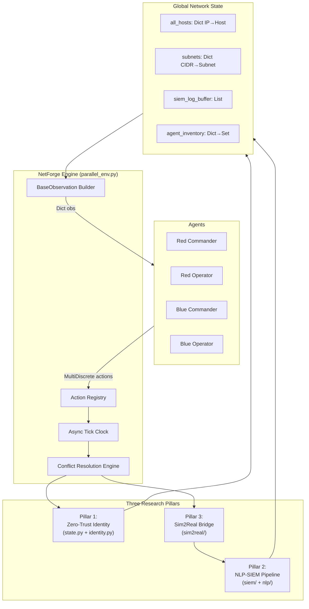
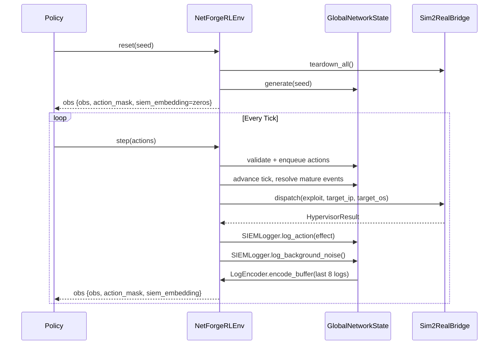

# Architecture Overview

High-level technical architecture of the NetForge RL engine.

## System Diagram

## Three Research Pillars

### Pillar 1 — Zero-Trust Identity
Hard cryptographic routing constraints. See [Zero-Trust Architecture](zero_trust.md).

### Pillar 2 — NLP-SIEM Pipeline
Stochastic Windows Event XML + 128-dim TF-IDF encoder. See [NLP-SIEM Pipeline](nlp_siem.md).

### Pillar 3 — Sim2Real Bridge
Dual-mode hypervisor (mock/Docker). See [Sim2Real Bridge](sim2real.md).

## Episode Lifecycle

