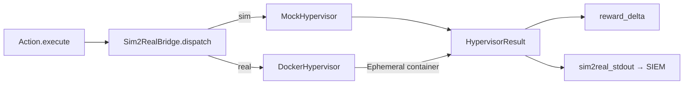

# Sim2Real Bridge

## Overview

Pillar 3 introduces a **dual-mode hypervisor bridge** that replaces stochastic probability rolls with live payload execution outcomes.

## Mode Switching

```python
# Training mode (default) — MockHypervisor, zero dependencies
env = NetForgeRLEnv({'sim2real_mode': 'sim'})

# Evaluation mode — DockerHypervisor, requires Docker daemon
env = NetForgeRLEnv({'sim2real_mode': 'real'})
```

## Architecture



## MockHypervisor

Zero-dependency training fallback. Samples from `payload_library.json` — 30+ authentic Metasploit/Mimikatz stdout strings. Applies OS-compatibility penalties and Gaussian latency jitter.

| Action | Base Success Rate | Latency (mean ± std) |
|--------|------------------|--------------------|
| `ExploitEternalBlue` | 72% | 4200 ± 800ms |
| `ExploitBlueKeep` | 58% | 3800 ± 600ms |
| `DumpLSASS` | 80% | 900 ± 200ms |
| `PassTheTicket` | 90% | 600 ± 150ms |

## DockerHypervisor

Spawns ephemeral Vulhub containers per exploit, executes benign echo-payload scripts, captures real `stdout`/`exit_code`, then destroys the container immediately. Falls back to `MockHypervisor` if Docker daemon is unreachable.

## Reward Delta Shaping

| Outcome | Delta |
|---------|-------|
| Success | `+5.0` |
| Clean failure | `-10.0` |
| Noisy failure (>5s latency) | `-20.0` |
| Infrastructure error (RC=2) | `-25.0` |
