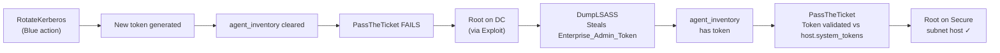

# Zero-Trust Identity Architecture

## Overview

Pillar 1 replaces the original CybORG environment's probabilistic routing with **mandatory cryptographic token enforcement**. Red agents are physically blocked from routing packets to the Secure subnet (`10.0.1.0/24`) unless they hold a valid `Enterprise_Admin_Token`.

## The ZTNA Physics Engine

The core enforcement lives in `GlobalNetworkState.can_route_to()`:

```python
def can_route_to(self, target_ip: str, agent_id: str = None) -> bool:
    host = self.all_hosts.get(target_ip)
    if host and host.subnet_cidr == '10.0.1.0/24':
        if agent_id:
            inventory = self.agent_inventory.get(agent_id, set())
            has_token = any(
                t.startswith('Enterprise_Admin_Token') for t in inventory
            )
            if not has_token:
                return False  # Hard block — no probability, no bypass
    return True
```

This is **not a probability gate** — it's a hard routing constraint. No amount of retrying `ExploitEternalBlue` against a Secure subnet host will succeed. The Red agent must execute the full identity chain.

## Identity Chain



## Key Data Structures

| Field | Location | Description |
|-------|----------|-------------|
| `host.system_tokens` | `Host` object | Tokens required to access this host |
| `host.cached_credentials` | `Host` object | Tokens stored in memory (LSASS) |
| `agent_inventory` | `GlobalNetworkState` | Tokens currently held by each Red agent |
| `Enterprise_Admin_Token` | Seeded at generation | Initial domain token |
| `Enterprise_Admin_Token_XXXXXX` | Post-rotation | Rotated token (random suffix) |

## RotateKerberos Mechanics

When Blue executes `RotateKerberos`:

1. **Flush** — `agent_inventory[agent_id].clear()` for ALL Red agents
2. **Generate** — new token `Enterprise_Admin_Token_<6-char-random>`
3. **Migrate** — all `host.system_tokens` and `host.cached_credentials` updated to new token
4. **Cost** — 5,000 funds + 1,500 business downtime score

Red must restart the entire credential-access chain from `DumpLSASS`.
