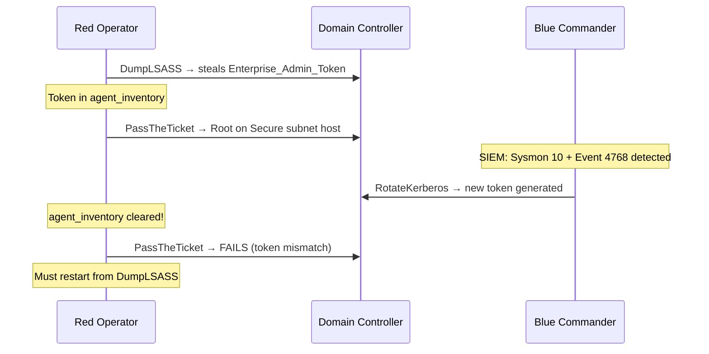

# Blue Team Action Catalogue

Complete reference for all 15 Blue Team / SOC actions. Each action documents its real-world SOC equivalent, cost mechanics, which Red actions it counters, and the SIEM signals that should trigger it.

---

## SOC Budget Overview

Blue agents operate under finite resources — careless spending loses the episode just as badly as being breached:

| Resource | Initial Value | Key Drain |
|----------|---------------|-----------|
| `agent_energy` | 50 | Each action costs energy |
| `agent_funds` | 10,000 | `RotateKerberos` (-5,000), `SecurityAwarenessTraining` (-2,000) |
| `business_downtime_score` | 0 | `IsolateHost` (+penalty), `RotateKerberos` (+1,500) |
| SOC concurrency | Max 2 active actions | Prevents coordinated over-response |

!!! tip "SOC Concurrency Limit"
    The environment enforces a **maximum of 2 simultaneously active Blue actions**. This models real SOC analyst bandwidth — an overwhelmed team cannot respond to every alert simultaneously.

---

## Monitoring & Analysis

### `Monitor`
**SOC Equivalent**: Tier-1 alert triage  
**Agent**: `blue_commander`

Passive monitoring sweep — reviews current SIEM alerts and updates the Blue agent's situational awareness. Low cost, no side effects.

| Property | Value |
|----------|-------|
| Cost | 1 energy |
| Effect | Refreshes observation data from SIEM buffer |
| When to use | Every tick as baseline — cheapest way to consume SIEM embeddings |
| Counters | Nothing directly — enables informed subsequent decisions |

---

### `Analyze`
**SOC Equivalent**: Tier-2 deep-dive investigation  
**Agent**: `blue_commander`  
**Real workflow**: Analyst pulls packet capture, queries Splunk, correlates across sources

Detailed forensic analysis of a specific host. Returns richer data than `Monitor` — privilege state, active services, compromise indicators.

| Property | Value |
|----------|-------|
| Cost | 3 energy |
| Duration | 2 ticks |
| Effect | Returns full `host` object data for target IP |
| SIEM trigger | Use after seeing `Sysmon 10` (LSASS access) or `Event 4648` (explicit credentials) |

---

## Containment Actions

### `IsolateHost`
**SOC Equivalent**: Network microsegmentation / EDR quarantine  
**Agent**: `blue_operator`  
**Real tool**: Windows Defender ATP isolation, Cisco ISE quarantine VLAN

Immediately disconnects a host from the network. The most powerful immediate containment action — but triggers an **instant interruption** of any Red action targeting that host.

| Property | Value |
|----------|-------|
| Cost | 5 energy |
| Effect | Status → `isolated`, drops all active sessions on host |
| Interruption | **Cancels any in-progress Red actions targeting this IP** |
| Business penalty | Incurs `business_downtime_score` increase (unavailability SLA) |
| SIEM trigger | `Sysmon 10` (LSASS), `Event 4648` (PTH), high-severity anomaly |

!!! warning "Business Cost Trade-off"
    Isolating a production server during business hours has real cost. Over-isolating uncompromised hosts wastes budget and incurs downtime penalties. The Blue agent must learn **when isolation is worth the cost**.

---

### `RestoreHost`
**SOC Equivalent**: Re-enabling quarantined endpoint after verification  
**Agent**: `blue_operator`

Reverses `IsolateHost` — returns a verified-clean host to `online` status and resets privilege to `None`. Critical for maintaining business availability after containment.

| Property | Value |
|----------|-------|
| Cost | 3 energy |
| Precondition | Host must be in `isolated` state |
| Effect | Status → `online`, clears `compromised_by`, resets `privilege` |
| When to use | After `Remove` or `RestoreFromBackup` confirms the host is clean |

---

### `Remove`
**SOC Equivalent**: EDR-based threat remediation (kill malicious process, quarantine files)  
**Agent**: `blue_operator`  
**Real tool**: CrowdStrike Falcon prevent, Carbon Black response

Evicts an active Red agent from a host without requiring full re-imaging. Faster than `RestoreFromBackup` but less thorough — persistent malware may survive.

| Property | Value |
|----------|-------|
| Cost | 4 energy |
| Effect | Sets `privilege = None`, `compromised_by = None` |
| Risk | Does not clear persistent backdoors (use `RestoreFromBackup` for APT cleanup) |
| SIEM trigger | `Event 4688` with suspicious process chain |

---

### `RestoreFromBackup`
**SOC Equivalent**: Bare-metal reimaging from clean snapshot  
**Agent**: `blue_operator`  
**Real workflow**: SCCM OSD task sequence, VMware snapshot revert

Nuclear option — completely restores a host from a known-good image. Eradicates all persistence mechanisms including rootkits, backdoors, and modified registry entries.

| Property | Value |
|----------|-------|
| Cost | 8 energy |
| Duration | 5 ticks (imaging takes time) |
| Effect | Full host state reset — privilege, status, system_integrity all clean |
| When to use | Post-`DumpLSASS` or confirmed APT persistence |

---

## Network Controls

### `ConfigureACL`
**SOC Equivalent**: Firewall rule deployment / micro-segmentation  
**Agent**: `blue_operator`  
**Real tool**: Windows Firewall GPO, Cisco ASA ACL, pf / iptables

Dynamically drops traffic to a specific port on a subnet. Effective for blocking known exploit vectors — e.g., blocking port 445 (SMB) after detecting EternalBlue reconnaissance.

| Property | Value |
|----------|-------|
| Cost | 2 energy |
| Target | Subnet CIDR + port number |
| Effect | `BlockPortCommand` adds rule to `global_state.firewall_rules` |
| Counter | Directly blocks `ExploitEternalBlue` (port 445), `ExploitBlueKeep` (port 3389) |
| SIEM trigger | Sysmon 3 bursts to a specific port from DMZ source |

!!! tip "Proactive Hardening"
    A well-trained Blue Commander should learn: "If I see port 445 scanning activity in the SIEM embedding, deploy `ConfigureACL` **before** the exploit attempt lands." This is proactive defence rather than reactive containment.

---

## Deception Operations

### `DeployDecoy`
**SOC Equivalent**: Honeypot deployment  
**Agent**: `blue_commander`

Activates a generic decoy node that poisons Red's `DiscoverRemoteSystems` results. Red will receive fake host lists and waste ticks scanning non-existent targets.

---

### `DecoyApache`
**SOC Equivalent**: High-interaction web honeypot  
**Agent**: `blue_commander`

Deploys a fake Apache web server. When Red's `DiscoverNetworkServices` targets this host, it returns fake services `['Fake_Apache_80', 'Fake_SSH_2222']` — leading Red to attempt exploits on a honeypot rather than a real target.

---

### `DecoySSHD`
**SOC Equivalent**: SSH tarpit / honeypot  
**Agent**: `blue_commander`

Fake SSH server. Poisons `DiscoverNetworkServices` with `['Fake_SSH_22']`. SSH brute-force and exploitation attempts all fail harmlessly.

---

### `DecoyTomcat`
**SOC Equivalent**: Java servlet honeypot  
**Agent**: `blue_commander`

Fake Tomcat server targeting Java web application exploits (CVE-2020-1938, Ghostcat).

---

### `Misinform`
**SOC Equivalent**: Active deception / adversary manipulation  
**Agent**: `blue_commander`

Advanced deception — injects deliberately misleading information into Red's intelligence picture. This models real "deceptive defence" techniques where defenders deliberately poison the attacker's situational awareness.

---

### `DeployHoneytoken`
**SOC Equivalent**: Canary tokens / HoneyDocs  
**Agent**: `blue_commander`  
**Real tool**: Canarytokens.org, Thinkst Canary

Plants fake credentials (honeytoken) in a host's accessible files. When Red's `DumpLSASS` or similar action collects credentials, the honeytoken is included. If Red then attempts to use the token, **immediate high-confidence detection** is triggered:

| Property | Value |
|----------|-------|
| Effect | Sets `host.contains_honeytokens = True` |
| Detection | If Red uses token: `HONEYTOKEN_TRIGGERED` alert with `severity=10`, **zero log latency** |
| Value | Perfect false-positive-free indicator — no trained analyst needed to act on this |

!!! tip "Best ROI Action"
    `DeployHoneytoken` on Domain Controller credential caches is one of the highest-value Blue actions. It's cheap, has zero business impact, and generates the **highest-confidence detection signal** in the environment.

---

## Identity & Zero-Trust

### `SecurityAwarenessTraining`
**SOC Equivalent**: Mandatory security training campaign  
**Agent**: `blue_commander`  
**Real tool**: KnowBe4, Proofpoint Security Awareness Training  
**Financial Cost**: 2,000 | **Duration**: 3 ticks

Deploys intensive anti-phishing training to all users in a subnet. Slashes the `human_vulnerability_score` of all hosts to **20% of its current value**, making `SpearPhishing` nearly impossible for the next N ticks.

| Property | Value |
|----------|-------|
| Formula | `new_score = current_score * 0.2` |
| Counters | `SpearPhishing` (T1566.001) |
| Duration | 3 ticks until training completes |
| Tradeoff | Expensive (2,000 funds + downtime) but protects entire people-layer |

---

### `RotateKerberos`
**SOC Equivalent**: Emergency domain credential rotation / Kerberos key rollover  
**Agent**: `blue_commander`  
**Real workflow**: Active Directory `krbtgt` account password reset (double reset procedure)  
**Financial Cost**: 5,000 | **Business Downtime**: +1,500 | **Duration**: 4 ticks

The **apex defensive action**. Globally rotates all Domain Kerberos TGT keys, immediately invalidating every `Enterprise_Admin_Token` held by Red agents — regardless of how many hosts Red has compromised.

| Property | Value |
|----------|-------|
| Effect | Flushes `agent_inventory` for ALL Red agents globally |
| Effect | Generates new `Enterprise_Admin_Token_XXXXXX` across all Secure subnet hosts |
| Effect | Adds `business_downtime_score += 1,500` |
| Financial cost | `-5,000` from `agent_funds` |
| Counters | `PassTheTicket`, `DumpLSASS` (invalidates stolen tokens, forces Red to restart) |
| SIEM trigger | `Event 4768` (unusual TGT volume), `Event 4776` anomalies |

!!! danger "Use Only When Justified"
    `RotateKerberos` costs 5,000 funds (50% of the Blue Commander's starting budget) and causes massive business downtime. A Blue policy that rotates Kerberos unnecessarily will go bankrupt before Red reaches the Secure subnet. The Blue LSTM must learn to use this **only** when it has high-confidence evidence of credential theft (e.g., strong `Sysmon 10` signal in the SIEM embedding).

