# Cybersecurity Reference — Environment Overview

This page explains **how NetForge RL models real enterprise attack and defence dynamics** from a cybersecurity perspective. Understanding these concepts will help you interpret agent behaviour, design reward functions, and connect simulation results to real-world threat intelligence.

---

## The Information Asymmetry Problem

In a real SOC, defenders never have perfect visibility. NetForge RL models this fundamental asymmetry:

| Dimension | Red Team (Attacker) | Blue Team (Defender) |
|-----------|---------------------|----------------------|
| **Visibility** | Knows what it has compromised | Sees only SIEM logs (with latency) |
| **Advantage** | Stealth — can act before detection | Telemetry — SIEM embeddings in observation |
| **Constraint** | Kill-chain ordering is mandatory | Business downtime costs limit aggression |
| **Information** | Full knowledge of own inventory | Partial — POMDP, fog of war |

This is the core research problem: **how does a Blue LSTM policy learn to distinguish malicious SIEM signals from background noise, and respond before an APT achieves its objective?**

---

## The Network Topology

The simulated enterprise network is segmented into three subnets that map to real corporate security zones:

```mermaid
graph LR
    Internet((Internet)) -->|Exposed| DMZ

    subgraph DMZ["DMZ — 10.0.0.0/24 (Open)"]
        WEB[Web Server<br/>Apache/nginx]
        MAIL[Mail Server<br/>SMTP/IMAP]
        JUMP[Jump Host<br/>RDP/SSH]
    end

    subgraph CORP["Corporate — 10.0.2.0/24 (Internal)"]
        WS1[Workstation 1<br/>Windows 10]
        WS2[Workstation 2<br/>Windows 10]
        FILE[File Server<br/>SMB 445]
    end

    subgraph SEC["Secure — 10.0.1.0/24 (Zero-Trust 🔒)"]
        DC[Domain Controller<br/>AD / Kerberos]
        HVR[Hypervisor<br/>ESXi]
        PLC[PLC Controller<br/>OT / ICS]
    end

    DMZ -->|Lateral movement| CORP
    CORP -->|ZTNA Token Required| SEC
```



### Why This Matters for RL

- **DMZ** is freely accessible — Red starts here. Easy to scan and exploit, but low-value targets.
- **Corporate** requires lateral movement — Red must first establish a foothold in DMZ, then pivot.
- **Secure** is Zero-Trust enforced — Red **physically cannot route packets** to `10.0.1.0/24` without a valid `Enterprise_Admin_Token`. This is not a probability gate; it is a hard routing constraint in `GlobalNetworkState.can_route_to()`.

---

## How Ticks Map to Real Dwell Time

NetForge RL runs on an **asynchronous tick clock**. Actions don't resolve instantly — they take `duration` ticks. This maps to real APT temporal patterns:

| Real World | NetForge RL |
|------------|-------------|
| APT dwell time: days to weeks | 200–500 ticks of Red activity |
| Lateral movement: hours | 5–20 tick action chains |
| Incident response: minutes | 2–8 tick Blue actions |
| Log forwarding latency: seconds | `log_latency` = 2–5 ticks |

The tick granularity forces Red to **plan a coherent kill chain** rather than random action selection. An untrained Red policy achieves near-zero reward because:

1. `DumpLSASS` fails without `Root` privilege
2. `Root` requires a successful exploit
3. Exploits fail on unscanned hosts (wrong service, wrong OS)
4. Recon takes ticks during which Blue detects anomalous traffic

---

## Fog of War — What Blue Actually Sees

Blue agents observe the world through **three channels**:

### 1. Structured Observation Vector (256-dim)
Numeric features about known host states, subnet status, agent energy, funds, and tick counter.

### 2. SIEM Embedding (128-dim)
The most important signal. The NLP encoder encodes the last 8 SIEM log lines into a 128-dim TF-IDF LSA vector. These log lines are authentic Windows Event XML:

```xml
<Event xmlns="http://schemas.microsoft.com/win/2004/08/events/event">
  <System><EventID>4624</EventID>
    <TimeCreated SystemTime="2026-03-31T14:22:11.847Z"/>
    <Computer>10.0.1.1</Computer>
  </System>
  <EventData>
    <Data Name="SubjectUserName">Administrator</Data>
    <Data Name="LogonType">3</Data>
    <Data Name="IpAddress">10.0.0.7</Data>
    <Data Name="AuthenticationPackageName">NTLM</Data>
  </EventData>
</Event>
```

This is what a real Splunk pipeline would ingest. The Blue LSTM must learn that `LogonType=3` + `NTLM` + `IpAddress` from a DMZ machine = suspicious lateral movement indicator.

### 3. Action Mask (62-dim)
Binary validity mask preventing the agent from selecting illegal actions (e.g., Blue commander can't use operator-only actions).

---

## The Green Agent — Noise Generation

A passive **Green Agent** continuously generates background enterprise traffic — Kerberos renewals, DNS queries, Sysmon network connections, NTLM authentications — to simulate the constant low-level noise in real corporate networks.

This noise is probabilistically injected into the SIEM buffer (15% chance per tick). The Blue LSTM must learn to:

- **Ignore** `Event ID 4624` from a known workstation authenticated to a file server (normal)
- **Alert on** `Event ID 4624` from a DMZ web server to the Domain Controller at 3am (anomalous)

This is the **signal-to-noise discrimination** problem that makes NetForge RL a meaningful research challenge.

---

## Why Random Action Selection Fails

### Red Agent Failure Mode
A random Red policy fails because the kill chain has mandatory ordering dependencies:
```
NetworkScan → DiscoverNetworkServices → ExploitEternalBlue → PrivilegeEscalate → DumpLSASS → PassTheTicket → [Secure Subnet]
```
Each step has a **precondition** the previous step satisfies. Random selection skips steps, wastes energy, and exhausts the budget before achieving any meaningful compromise.

### Blue Agent Failure Mode
A random Blue policy fails because:
- `IsolateHost` on an uncompromised host wastes budget and incurs business downtime penalties
- `RotateKerberos` costs 5,000 funds — done unnecessarily, it bankrupts the SOC
- Without reading SIEM signals, Blue cannot distinguish which host to protect

The environment is designed so that **only policies that learn to reason about sequences and signals can succeed**.
