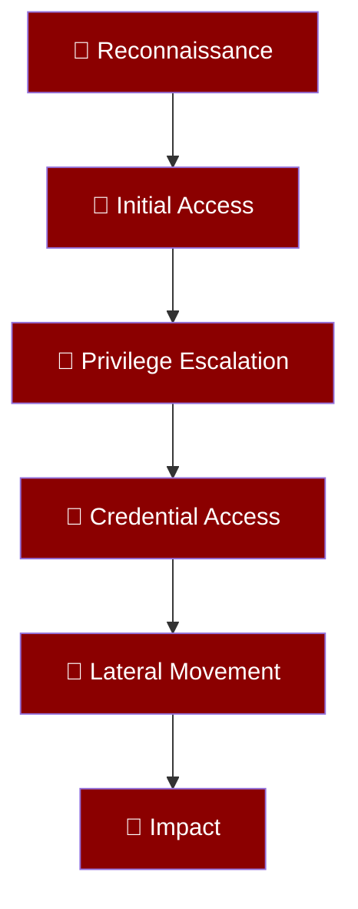

# Threat Model & MITRE ATT&CK Mapping

NetForge RL models a **targeted APT (Advanced Persistent Threat) intrusion** against an enterprise network with OT/ICS components. Every Red Team action is grounded in a real MITRE ATT&CK technique, giving researchers a direct bridge between simulation results and real threat intelligence.

---

## Threat Scenario

The simulated adversary follows an **APT kill chain** targeting:

1. **Initial objective**: Establish persistent access in the DMZ
2. **Intermediate objective**: Lateral movement to the Corporate subnet
3. **Final objective**: Breach the Secure subnet (Domain Controller + PLC) and execute impact

The Blue Team's goal is to detect and disrupt this progression before the APT achieves its final objective.

---

## MITRE ATT&CK Coverage



### Full ATT&CK Technique Mapping

| NetForge Action | MITRE Tactic | Technique ID | Technique Name | Real-World Tooling |
|-----------------|--------------|--------------|----------------|-------------------|
| `NetworkScan` | Reconnaissance | **T1046** | Network Service Discovery | nmap, masscan |
| `DiscoverRemoteSystems` | Discovery | **T1018** | Remote System Discovery | net view, BloodHound |
| `DiscoverNetworkServices` | Discovery | **T1046** | Network Service Scanning | nmap -sV, Nessus |
| `SpearPhishing` | Initial Access | **T1566.001** | Spearphishing Attachment | Custom lures, GoPhish |
| `ExploitEternalBlue` | Initial Access | **T1210** | Exploitation of Remote Services | MS17-010, EternalBlue |
| `ExploitBlueKeep` | Initial Access | **T1210** | Exploitation of Remote Services | CVE-2019-0708 PoC |
| `ExploitHTTP_RFI` | Initial Access | **T1190** | Exploit Public-Facing Application | PHP RFI, Webshell |
| `ExploitRemoteService` | Execution | **T1059** | Command and Scripting Interpreter | Bash, cmd.exe |
| `PrivilegeEscalate` | Privilege Escalation | **T1068** | Exploitation for Privilege Escalation | JuicyPotato, MS16-032 |
| `JuicyPotato` | Privilege Escalation | **T1134.001** | Token Impersonation/Theft | JuicyPotato |
| `V4L2KernelExploit` | Privilege Escalation | **T1068** | Exploitation for Privilege Escalation | V4L2 Linux kernel CVE |
| `DumpLSASS` | Credential Access | **T1003.001** | LSASS Memory | Mimikatz, ProcDump |
| `PassTheTicket` | Lateral Movement | **T1550.003** | Pass the Ticket | Rubeus, Impacket |
| `ShareIntelligence` | Collection | **T1005** | Data from Local System | BloodHound ingestor |
| `KillProcess` | Defense Evasion | **T1562.001** | Impair Defenses: Disable Tools | taskkill, SIGKILL |
| `Impact` | Impact | **T1486** | Data Encrypted for Impact | Ransomware payload |
| `OverloadPLC` | Impact | **T0882** | Theft of Operational Information | Stuxnet-style kinetics |

---

## The APT Kill Chain in NetForge RL

The kill chain is enforced through **preconditions** — each step requires the previous to succeed:

```mermaid
flowchart LR
    A["🔍 NetworkScan<br/>T1046"] --> B["🔍 DiscoverRemoteSystems<br/>T1018"]
    B --> C["🔍 DiscoverNetworkServices<br/>T1046"]
    C --> D["💥 Exploit<br/>T1210 / T1190"]
    D --> E["⬆️ PrivilegeEscalate<br/>T1068"]
    E --> F["🔑 DumpLSASS<br/>T1003.001"]
    F --> G["↔️ PassTheTicket<br/>T1550.003"]
    G --> H["💣 Impact / OverloadPLC<br/>T1486 / T0882"]

    style A fill:#2d4a6e,color:#fff
    style B fill:#2d4a6e,color:#fff
    style C fill:#2d4a6e,color:#fff
    style D fill:#6e2d2d,color:#fff
    style E fill:#6e2d2d,color:#fff
    style F fill:#6e4a2d,color:#fff
    style G fill:#6e4a2d,color:#fff
    style H fill:#6e0000,color:#fff
```



### Why Ordering Matters

The preconditions are hard-coded physics constraints:

| Step | Precondition | What Fails Without It |
|------|-------------|----------------------|
| Any exploit | `can_route_to(target_ip)` returns True | `validate()` returns False, action skipped |
| `PrivilegeEscalate` | Host in `compromised_by` | Cannot escalate uncompromised host |
| `DumpLSASS` | `host.privilege == 'Root'` | `validate()` blocks execution |
| `PassTheTicket` | Token in `agent_inventory` | Returns `success=False`, no state change |
| Secure subnet access | `Enterprise_Admin_Token` in inventory | Routing physically blocked at physics layer |

---

## Social Engineering Vector

`SpearPhishing` bypasses the technical kill chain entirely — it targets the **human vulnerability score** of workstation users:

```python
# From social_engineering.py
success_chance = host.human_vulnerability_score * 0.85
```

The `human_vulnerability_score` (0.0–1.0) is a per-host property representing user security awareness. Blue's `SecurityAwarenessTraining` reduces this to 20% of its current value, temporarily making SpearPhishing nearly impossible.

This models the **people layer** of the defence-in-depth model:

```
Technical Controls → Process Controls → People Controls
     (ZTNA)              (SOC Actions)        (SAT)
```

---

## OT/ICS Impact Vector

`OverloadPLC` targets Physical Layer Circuits (PLCs) in the Secure subnet OT zone. This maps to:

- **Real world**: Stuxnet, Triton/TRISIS, CRASHOVERRIDE
- **MITRE ICS**: T0882 (Theft of Operational Information), T0855 (Unauthorized Command Message)
- **Reward**: `+10,000` for Red (catastrophic kinetic impact), `-10,000` for Blue

This impact magnitude is designed to create a **non-linear risk landscape** — a trained Red policy must decide whether to invest in the expensive ZTNA breach (DumpLSASS + PassTheTicket chain) for the massive OT payout, or settle for lower-value ransomware deployments on Corporate subnet hosts.
