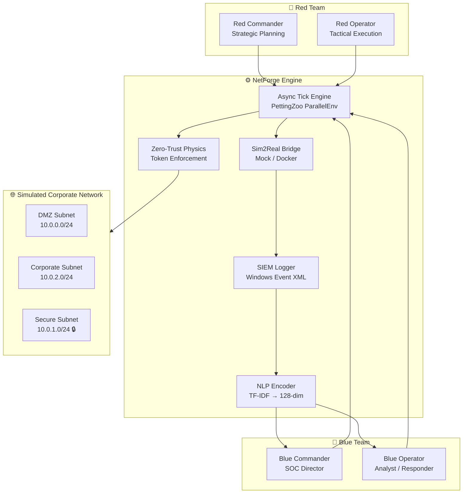

# NetForge RL

-   :material-shield-lock:{ .lg .middle } **Zero-Trust Identity**

    ---

    Cryptographic token enforcement blocks Red agents from accessing secured subnets without valid Kerberos credentials.

    [:octicons-arrow-right-24: Architecture](architecture/zero_trust.md)

-   :material-docker:{ .lg .middle } **Sim2Real Bridge**

    ---

    Dual-mode hypervisor — `MockHypervisor` for fast training, `DockerHypervisor` for live Vulhub container execution.

    [:octicons-arrow-right-24: Sim2Real](architecture/sim2real.md)

-   :material-brain:{ .lg .middle } **NLP-SIEM Pipeline**

    ---

    Real Windows Event XML + Sysmon logs encoded into 128-dim TF-IDF vectors injected directly into the Blue LSTM policy.

    [:octicons-arrow-right-24: NLP-SIEM](architecture/nlp_siem.md)

-   :material-sword-cross:{ .lg .middle } **32 Actions**

    ---

    17 Red Team attack primitives and 15 Blue Team SOC responses, all mapped to real MITRE ATT&CK techniques.

    [:octicons-arrow-right-24: Action Reference](cybersec/red_actions.md)

---

## What is NetForge RL?

**NetForge RL** is a high-fidelity multi-agent reinforcement learning (MARL) cybersecurity environment designed for research-grade Sim2Real transfer. It is mathematically derived from the CAGE/CybORG challenge environment and evolved into a physically constrained network simulation where:

- **Red agents** execute realistic APT kill chains — recon, exploit, privilege escalation, lateral movement, and impact
- **Blue agents** operate a SOC under realistic POMDP conditions — partial observability, noisy telemetry, and business cost trade-offs
- **The environment** enforces cryptographic ZTNA constraints, asynchronous tick timing, and stochastic SIEM telemetry

NetForge RL bridges the gap between clean RL toy environments and the messy, probabilistic world of real enterprise security operations.

---

## Key Design Principles

### 1. Physically Constrained

Actions are not instant boolean state flips. Every action has a `duration`, agents can be interrupted mid-operation, and the ZTNA layer physically prevents routing unless cryptographic tokens are held.

### 2. POMDP with Realistic Noise

Blue agents never see ground truth. They observe SIEM telemetry with realistic log latency, false positives injected by the Green noise agent, and NLP-encoded Windows Event XML that requires learning to distinguish true positives from background traffic.

### 3. Sim-to-Real Transfer Ready

The `Sim2RealBridge` lets you train at 1000 steps/second using `MockHypervisor`, then evaluate using live Vulhub Docker containers with real exploit payload execution — with a single config flag change.

### 4. Attack Economics

Both teams operate under finite budgets (`agent_funds`, `agent_energy`, `agent_compute`). Reckless Blue isolation triggers `business_downtime_score` penalties modelling real SLA fines. Red must balance speed against cost.
